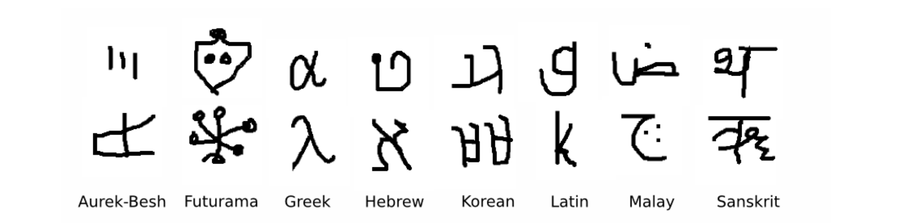
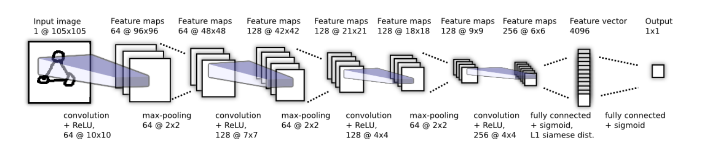
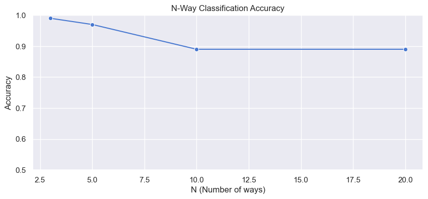
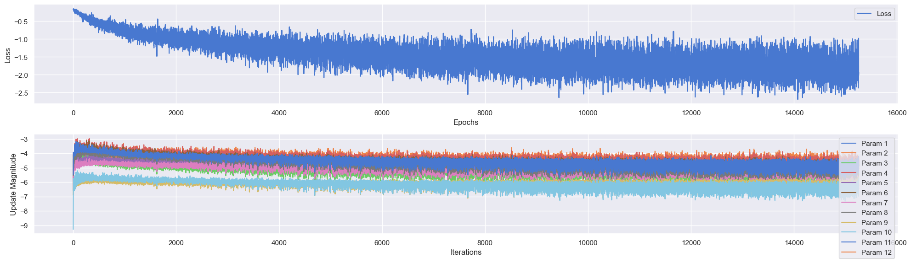
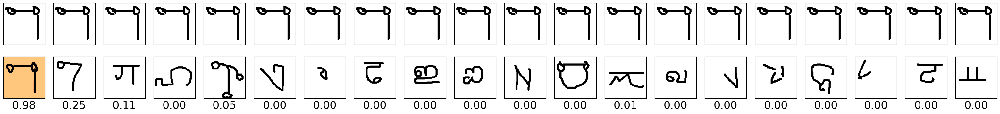

# Omniglot-Siamese

## Project Overview
This project implements a Siamese Neural Network for one-shot image recognition using the Omniglot dataset. The model is designed to learn and compare similarities between pairs of images, which is particularly useful for tasks like signature verification or face recognition.

## Features
Implementation of a Siamese Neural Network using **PyTorch**
- Custom dataset classes for Omniglot (OmniglotDataset and OmniglotTestDataset)
- Data augmentation using random affine transformations
- Training loop with AdamW optimizer and StepLR scheduler
- Accuracy evaluation on test set
- Single image classification visualization

## Model Architecture
The OmniglotModel class implements a Siamese Neural Network with the following structure:

- Convolutional layers:

  - 4 convolutional blocks with ReLU activation and max pooling
  - Input shape: 1x105x105
  - Output shape: 256x6x6

- Fully connected layers:

  - Flattening and linear layer to produce a 4096-dimensional feature vector
  - Sigmoid activation

- Output layer:

  - Linear layer to produce a single similarity score
  - Sigmoid activation

## Results
Presented results are different from paper's due to the difference in neural network architecture and data handling. Relatively modest metrics are caused by no hyperparameters search, absence of data transformations and short training procedure. However, model showed prediction capacity and thus can be improved in near future.

The experiment is run for 3-way, 5-way, 10-way, and 20-way classifications:

For evaluating the result, each image is compared with 20 different images from different classes. The L1 absolute difference is calculated between the feature representations of these images. This process allows the model to determine the similarity between the input image and a set of diverse class examples, testing its ability to distinguish between different classes in a one-shot learning scenario.

](image-5.png)

## References
The **OmniglotModel class**, which implements a Siamese Neural Network for one-shot image recognition. The model is based on the paper [Siamese Neural Networks for One-shot Image Recognition](https://www.cs.cmu.edu/~rsalakhu/papers/oneshot1.pdf)
  Koch, Gregory, Richard Zemel, and Ruslan Salakhutdinov. "Siamese neural networks for one-shot image recognition." ICML Deep Learning Workshop. Vol. 2. 2015.

## Credits

I would like to give credit to a blog post that introduced me to this paper, when I was searching for Siamese Networks. The blog post  also includes code for this paper, despite having some differences regarding this repo (Adam optimizer is used, layerwise learning-rate option is not available). It is a great blog post go check it out: 

- [One Shot Learning and Siamese Networks in Keras](https://sorenbouma.github.io/blog/oneshot/)